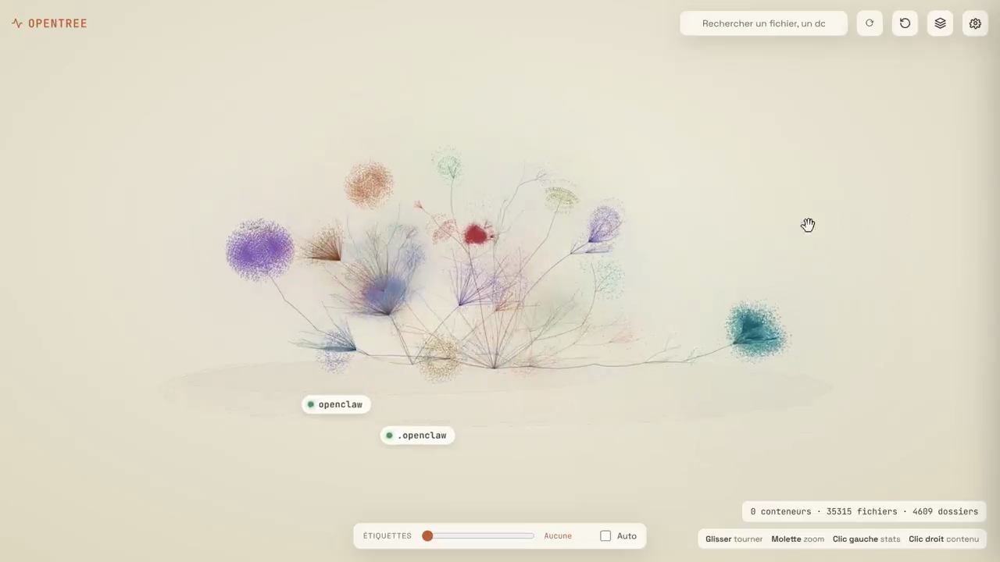
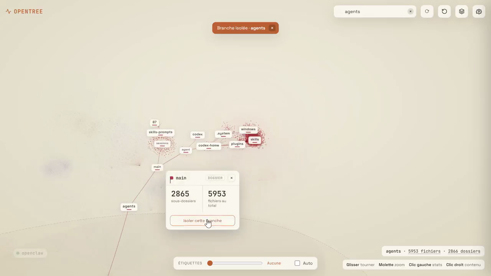

<div align="center">

# OpenTree

### Explorez l'architecture de votre instance OpenClaw comme un paysage vivant.

Visualisation 3D des fichiers, dossiers et conteneurs Docker, directement dans le navigateur.

[Découvrir la démo vidéo](https://www.linkedin.com/posts/tristanbannier_opentree-voir-son-architecture-compl%C3%A8te-activity-7479847535889784832-KkRc) · [Installation](#installation) · [Fonctionnement](#fonctionnement)

</div>



<p align="center"><sub>Capture de la démonstration publiée par l'auteur. Les chiffres visibles correspondent à son instance au moment de l'enregistrement.</sub></p>

## Pourquoi OpenTree ?

Une arborescence classique montre où se trouve un fichier. OpenTree aide à **comprendre comment un système est organisé** : ses racines, ses branches, les zones denses et les éléments à retrouver. Chaque fichier devient un point ; les dossiers structurent la scène en branches explorables.

| Explorer | Retrouver | Observer |
| --- | --- | --- |
| Parcourir plusieurs racines hôtes et les conteneurs Docker dans une même scène. | Chercher un nom, isoler une branche et afficher ses fichiers ou dossiers. | Voir les volumes, les métadonnées et les signaux de modification sur 30 jours. |



### Dans l'interface

- **Vue 3D interactive** : rotation, zoom et déplacement dans l'arborescence.
- **Niveaux de lecture** : affichage progressif des étiquettes, automatique ou réglé manuellement.
- **Recherche et isolation** : mise en évidence des résultats, puis focalisation sur une branche.
- **Fiches contextuelles** : chemin, taille, nombre de descendants et historique visuel.
- **Instantané actualisable** : bouton de rafraîchissement pour reconstruire la vue à la demande.

## Installation

OpenTree est un plugin OpenClaw. Le dépôt contient le manifeste, le code compilé et l'interface nécessaires à l'installation :

```bash
openclaw plugins install git:github.com/TristanBqn/opentree
```

Après activation du plugin et redémarrage de la gateway si nécessaire, ouvrez **`/opentree/`** sur l'adresse de votre gateway OpenClaw. Exemple avec un tunnel SSH vers un serveur :

```bash
ssh -L 18789:127.0.0.1:18789 utilisateur@votre-serveur
# Puis ouvrir http://localhost:18789/opentree/
```

> **Accès réseau** — La route utilise `auth: "plugin"` dans le code actuel. Elle ne demande pas elle-même de mot de passe au navigateur. Gardez la gateway sur un réseau privé ou derrière un contrôle d'accès que vous gérez. Le tunnel SSH ci-dessus est une option simple.

### Choisir les racines à afficher

Ces variables d'environnement sont lues au démarrage de la gateway :

| Variable | Valeur par défaut | Rôle |
| --- | --- | --- |
| `OPENTREE_HOST_ROOT` | `~/openclaw` | Une ou plusieurs racines à parcourir, séparées par des virgules. |
| `OPENTREE_HOST_NAME` | `~/openclaw` | Noms correspondants affichés dans la scène, séparés par des virgules. |
| `OPENTREE_DATA` | `<dépôt>/.data` | Dossier du journal local des modifications. |
| `DOCKER_SOCKET` | `/var/run/docker.sock` | Socket utilisé pour découvrir les conteneurs Docker. |

Exemple : `OPENTREE_HOST_ROOT=/app,/home/node/.openclaw` et `OPENTREE_HOST_NAME=app,.openclaw`. Les conteneurs ne s'affichent que si le socket Docker est accessible au processus OpenClaw.

## Fonctionnement

```text
Racines hôtes + Docker
         ↓
  Scan et métadonnées
         ↓
  Instantané mis en cache ──→ /opentree/api/snapshot
         ↓
  Interface Three.js      ──→ /opentree/
```

Le plugin parcourt les racines configurées, collecte les informations disponibles sur Docker, puis sert un instantané compressible à l'interface. Un observateur enregistre les modifications de fichiers pendant son exécution. Le bouton de rafraîchissement reconstruit l'instantané.

**Lecture des signaux d'activité.** Le graphique sur 30 jours utilise les modifications observées lorsqu'elles existent. Sinon, il s'appuie sur la date de dernière modification du fichier : ce signal de repli n'est pas un comptage de consultations. Les lectures de fichiers ne sont pas suivies.

**Aperçu du contenu.** La bulle de contenu de l'interface actuelle affiche un extrait illustratif construit côté client ; elle ne lit pas le fichier réel. Ne l'utilisez pas comme visionneuse de fichiers.

## Développement

Le viewer se trouve dans `inspector/`, le backend dans `lib/`, et l'entrée du plugin dans `src/`. Le code compilé de `dist/` est versionné pour permettre l'installation directe depuis Git.

```bash
npm install --no-save openclaw @types/node typescript
npm test
```

Après toute modification de `src/`, exécutez `npm run build` et versionnez aussi `dist/`. Les tests couvrent principalement le backend ; le rendu visuel doit être vérifié dans un navigateur.

---

Créé par [Tristan Bannier](https://github.com/TristanBqn) · [Voir la démonstration](https://www.linkedin.com/posts/tristanbannier_opentree-voir-son-architecture-compl%C3%A8te-activity-7479847535889784832-KkRc)
